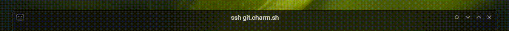
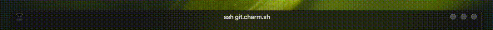
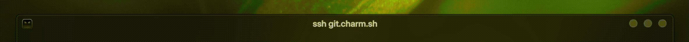
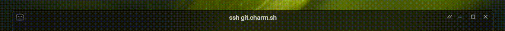

# Kustom Breeze Enhanced
A spiced-up remix of Sierra Breeze Enhanced—now with extra usability, fresh button styles, and a bit of tastefully applied chaos.

#### Tweaks
- **Clickable Corners & Edges ("Magic Corners")**
Fitts’s Law enjoyers, rejoice. The corners and edges are now hit targets, just like the Windows Start button or every theme that respects sanity. Breeze? Yes. BreezeEnhanced? Yes. SierraBreezeEnhanced had it—then someone thought it was a bug and axed it. I'm putting it back where it belongs.

- Opacity based Titlebar text (Window title/caption) color.
Tailored for translucent themes: the window title now picks up just a hint of background color. It’s subtle, it’s slick, and it keeps the caption from looking like it’s floating in a void.

- Darker titlebar - `#121212`
To blend with my [Zephyr Kvantum](https://github.com/Rudraksh88/zephyr-kvantum) dark theme. Combined with a matched opacity drop (to offset Kvantum’s opacity values), it pulls off that clean, frameless aesthetic we all love.

#### New Button Styles
- **Plasma**
The classic, reimagined with flair. The buttons now glow to full opacity on hover. And for the 'Always on top' button, added a custom hollow/filled dot that looks right at home in the titlebar.

- **Mac Mono**
A monochrome version of the macOS Sierra theme. And they also are opacity-based so doesn't look out of place in a translucent theme. The 'Always on top' here is only visible on hover/active as mac themes look better with the traditional 3 button setup.


- **Zephyr**
My own original flavor. Originally lived in a personal fork of BreezeEnhanced called [Zephyr](https://github.com/Rudraksh88/zephyr). That got borked by `KDecoration3`, so I gave it a new home here. Now with all the new SBE goodness baked in.


#### Rest all of the existing goodness from SBE remains ✨

## ⚙️ Installation
After installing, you’ll need to restart KWin for the decoration to show up:

On X11: run `kwin_x11 --replace`
On Wayland: run `kwin_wayland --replace`

You can run that from KRunner (Alt+Space or Alt+F2), or just log out and back in like it's 2005. Once that’s done, you’ll find Sierra Breeze Enhanced in:
**System Settings → Colors & Themes → Window Decorations**

## 🧰 Build from Source
> ⚠️ Requires Plasma 6.3 or later.

### Step 1: Install Dependencies
#### Ubuntu/Debian
```bash
sudo apt install build-essential libkf6config-dev libkdecorations2-dev qtdeclarative6-dev extra-cmake-modules libkf6guiaddons-dev libkf6configwidgets-dev libkf6windowsystem-dev libkf6coreaddons-dev libkf6iconthemes-dev gettext cmake
```

#### Arch
```bash
sudo pacman -S base-devel
sudo pacman -S kdecoration qt6-declarative
sudo pacman -S cmake extra-cmake-modules
```

#### Fedora
```bash
sudo dnf install cmake extra-cmake-modules kf6-kiconthemes-devel
sudo dnf install "cmake(Qt6Core)" "cmake(Qt6Gui)" "cmake(Qt6DBus)" "cmake(KF6GuiAddons)" "cmake(KF6WindowSystem)" "cmake(KF6I18n)" "cmake(KDecoration3)" "cmake(KF6CoreAddons)" "cmake(KF6ConfigWidgets)"
sudo dnf install qt6-qt5compat-devel kf6-kcmutils-devel qt6-qtbase-private-devel
```

#### Alpine
```bash
sudo apk add extra-cmake-modules qt6-qtbase-dev qt6-qt5compat-dev kcmutils-dev kdecoration-dev kcoreaddons-dev kguiaddons-dev kconfigwidgets-dev kwindowsystem-dev ki18n-dev kiconthemes-dev
```

### Step 2: Compile & Install
#### Easy Mode™ – With Script
```bash
chmod +x install.sh
./install.sh
```

#### Manual Mode
```bash
mkdir build && cd build
cmake .. -DCMAKE_INSTALL_PREFIX=/usr -DCMAKE_BUILD_TYPE=Release -DKDE_INSTALL_LIBDIR=lib -DBUILD_TESTING=OFF -DKDE_INSTALL_USE_QT_SYS_PATHS=ON
make
sudo make install
```

## 🗑️ Uninstall
- If you installed via the script, just run `./uninstall.sh` in the same directory.
```bash
chmod +x uninstall.sh
./uninstall.sh
```

- If you installed manually, run:
```bash
cd build
sudo make uninstall
```

## Credits
Shoutout to the original Breeze, Sierra Breeze, and Breeze Enhanced—this wouldn’t exist without them.
I just added some extra spice.